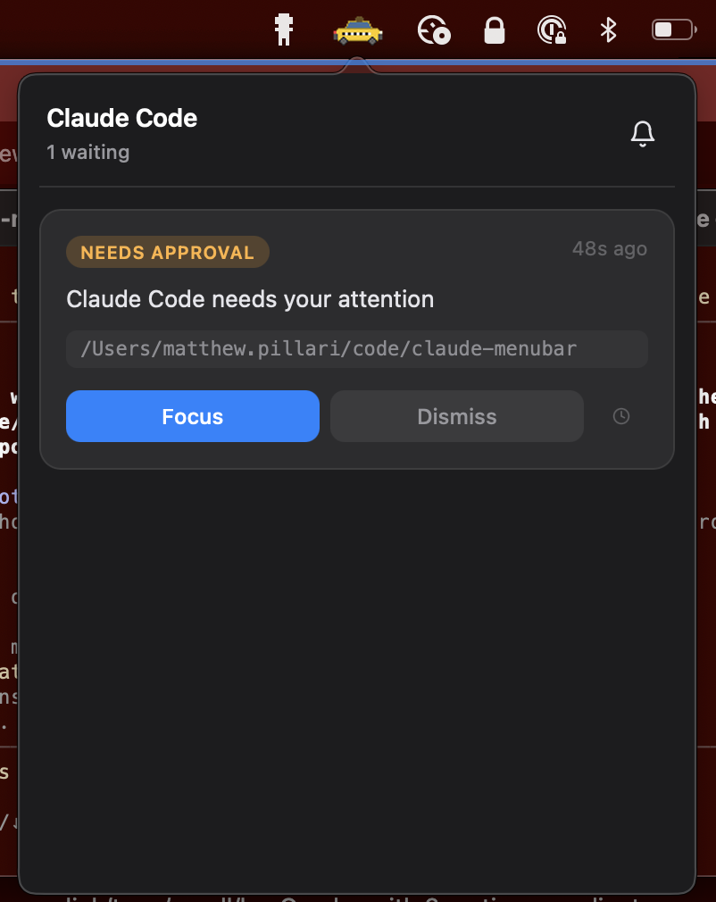

# Claude Menubar

A macOS menu bar app that notifies you when [Claude Code](https://docs.anthropic.com/en/docs/claude-code) needs your attention.

When Claude Code is waiting -- permission requests, questions, tool approvals, or a finished turn -- a taxi icon lights up in your menu bar. Click it to see what's pending, jump straight to the right terminal tab, or snooze it for later.

<p align="center">
  
</p>

<p align="center">
  
</p>

## Features

- **Menu bar notifications** -- a flashing taxi icon when any Claude Code session needs input
- **Notification cards** with type badges (Needs Approval, Waiting, Your Turn), timestamps, tool details, and working directory
- **Focus button** -- brings the exact terminal tab to the foreground (iTerm2 and Terminal.app match by TTY; other terminals activate the app)
- **Snooze** -- hide a notification for 1 min to 1 day, or set a custom duration
- **Sound alert** -- plays a system sound on new notifications (toggleable from the popover)
- **Auto-cleanup** -- stale notifications are removed after 1 hour or when the Claude process exits
- **Multi-session** -- tracks notifications across multiple concurrent Claude Code sessions
- **Standalone hooks** -- the hook scripts use only the Python standard library, so they run instantly with no virtualenv activation

## Prerequisites

- macOS
- Python 3.10+
- [uv](https://docs.astral.sh/uv/getting-started/installation/)
- [Claude Code](https://docs.anthropic.com/en/docs/claude-code) installed and working

## Installation

Clone the repo and run the install script:

```bash
git clone https://github.com/mpillari/claude-menubar.git
cd claude-menubar
./install.sh
```

The installer will:

1. Install Python dependencies via `uv sync`
2. Create the notification inbox at `~/.claude-menubar/inbox/`
3. Configure Claude Code hooks in `~/.claude/settings.json` (nondestructive -- your existing hooks are preserved)
4. Optionally create a macOS LaunchAgent so the app starts on login

### What the hooks do

The installer registers three hooks with Claude Code:

| Hook event | Script | Purpose |
|---|---|---|
| `Notification` | `hooks/notify_hook.py` | Creates a notification when Claude needs input (permission requests, questions, etc.) |
| `Stop` | `hooks/stop_hook.py` | Creates a "your turn" notification when Claude finishes responding |
| `PreToolUse` | `hooks/clear_hook.py` | Clears the notification for a session when Claude resumes work |

If you already have hooks configured for these events, the installer appends alongside them rather than replacing them.

### Manual hook setup

If you prefer to configure hooks yourself, add the following to `~/.claude/settings.json` (adjust paths to match where you cloned the repo):

```json
{
  "hooks": {
    "Notification": [
      {
        "matcher": "",
        "hooks": [
          {
            "type": "command",
            "command": "python3 /path/to/claude-menubar/hooks/notify_hook.py"
          }
        ]
      }
    ],
    "Stop": [
      {
        "matcher": "",
        "hooks": [
          {
            "type": "command",
            "command": "python3 /path/to/claude-menubar/hooks/stop_hook.py"
          }
        ]
      }
    ],
    "PreToolUse": [
      {
        "matcher": "",
        "hooks": [
          {
            "type": "command",
            "command": "python3 /path/to/claude-menubar/hooks/clear_hook.py"
          }
        ]
      }
    ]
  }
}
```

If you already have entries under any of these hook events, just append the new object to the existing array.

## Usage

If you skipped auto-start during installation, run manually:

```bash
cd claude-menubar
uv run claude-menubar
```

A taxi icon will appear in your menu bar. When a Claude Code session needs attention, the roof light turns on and the icon flashes. Click it to open the notification popover.

From the popover you can:

- **Focus** -- switch to the terminal tab where Claude is waiting
- **Dismiss** -- remove a single notification (or "Dismiss All" when there are several)
- **Snooze** -- temporarily hide a notification with preset or custom durations
- **Toggle sound** -- turn the alert chime on or off with the bell icon

## How it works

```
Claude Code (hook event)
    |
    v
hooks/notify_hook.py  ──>  writes JSON to ~/.claude-menubar/inbox/
                                     |
                                     v
                           claude-menubar app (polls every 2s)
                                     |
                                     v
                           Menu bar icon flashes + sound plays
                                     |
                                     v
                           Click icon -> popover with notification cards
```

The hook scripts are standalone Python (stdlib only) and write notification files as JSON to a shared inbox directory. The menu bar app polls the inbox, detects new files, and renders them in a WebKit-based popover. When you click Focus, it uses AppleScript to bring the correct terminal tab to the foreground.

## Uninstall

Stop the app and remove the LaunchAgent:

```bash
launchctl unload ~/Library/LaunchAgents/com.claude-menubar.app.plist
rm -f ~/Library/LaunchAgents/com.claude-menubar.app.plist
```

Remove the hooks from `~/.claude/settings.json` -- delete the entries whose commands reference `claude-menubar/hooks/`. If those are the only entries for a given event, you can remove the entire event key.

Optionally, remove cached data:

```bash
rm -rf ~/.claude-menubar
```

## Project structure

```
claude-menubar/
  claude_menubar/
    app.py             # Menu bar UI, popover, polling loop
    inbox.py           # Notification storage and lifecycle
    icons.py           # Programmatic taxi icon generation
    html_template.py   # Popover HTML/CSS/JS rendering
    terminal.py        # Terminal detection and focus via AppleScript
  hooks/
    notify_hook.py     # Notification hook (stdlib only)
    stop_hook.py       # Stop/turn-complete hook (stdlib only)
    clear_hook.py      # PreToolUse clear hook (stdlib only)
  install.sh           # Automated installer
  pyproject.toml       # Project metadata and dependencies
```

## License

MIT
